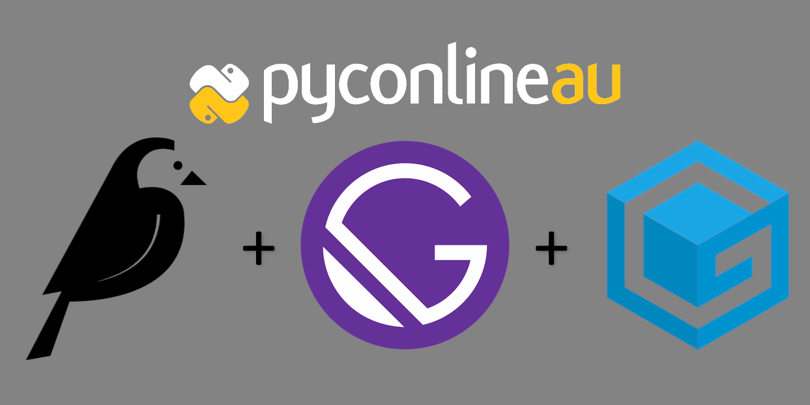

I've recently been working with Gatsby + Wagtail which includes proficiencies with GraphQL, Python, Django.

#### GOALS:

- Hooking Wagtail and Gatsby together
- Demo app created starting with gitpod

#### Assumptions:

1. Starting from gitpod
2. Python 3.8

## Why Wagtail

Learn more about [Wagtail](https://docs.wagtail.io/en/stable/) and what's coming next:

[What's Coming Next In Wagtail CMS | July 2020](https://www.youtube.com/watch?v=IMNFjrQ5OY4)

## Why GatsbyJS

Learn more about [GatsbyJS](https://www.gatsbyjs.com/docs/)

#### 0. START: Open Up Wagtail GitPod from Github

- Go to: [https://github.com/wagtail/wagtail-gitpod](https://github.com/wagtail/wagtail-gitpod)
- Click the "Open in GitPod" button, you'll then be taken to a page and click "Login to Github & Launch Workspace"
  - It will then take you to a GitPod instance created from a docker file (isnt that cool?). You're automatically given all of the requirements needed to start playing with the latest and greatest Wagtail Version.
  - If you want to learn more about what steps you're skipping by using the GitPod see the wagtail [Getting Started Docs](https://docs.wagtail.io/en/v2.0/getting_started/tutorial.html)
    

Your set up should look something like this:


Congratulations! You officially have a working Wagtail setup in your browser. To learn more about how to use GitPod, contribute to the same project / share workspaces, and export your work to your local machine, [you can find the GitPod docs](https://www.gitpod.io/docs/).

> NOTE: GitPod Workspaces are made to be temporary and will disappear after 14 days of inactivity. This is a great tool for prototyping or for our wagtail warriors knocking out a quick application. Although the IDE is well-built and has a developer experience that rivals a native IDE, its current features don't encourage this type of development.

#### I. Add Blog App

- run `python manage.py startapp blog`
- update **blog/models.py** with the following content:

```python


from __future__ import unicode_literals

from django.db import models

# Create your models here.
from wagtail.core.models import Page
from wagtail.core.fields import StreamField, RichTextField
from wagtail.core import blocks
from wagtail.admin.edit_handlers import FieldPanel, StreamFieldPanel
from wagtail.images.blocks import ImageChooserBlock

from grapple.models import (
    GraphQLString,
    GraphQLStreamfield,
)


class BlogIndexPage(Page):
    intro = RichTextField(blank=True)

    content_panels = Page.content_panels + [
        FieldPanel('intro', classname="full")
    ]


class BlogPage(Page):
    date = models.DateField("Post date")
    intro = models.CharField(max_length=255)
    author = models.CharField(max_length=255)
    body = StreamField(
        [
            ("heading", blocks.CharBlock(classname="full title")),
            ("paragraph", blocks.RichTextBlock()),
            ("image", ImageChooserBlock()),
        ]
    )

    content_panels = Page.content_panels + [
        FieldPanel("date"),
        FieldPanel("intro"),
        FieldPanel("author"),
        StreamFieldPanel("body", classname="full"),
    ]

    graphql_fields = [
        GraphQLString('heading'),
        GraphQLString('date'),
        GraphQLString('author'),
        GraphQLString('body'),
    ]

```

#### II. Install Graphene

run `pip install "graphene-django>=2.0"`

#### III. Install Wagtail Grapple

run `pip install wagtail_grapple`

#### IV. Install Wagtail Media

run `pip install wagtailmedia`

#### V. Configure Graphene and Grapple

add graphene settings to **base.py**:

```python
GRAPHENE = {
    'SCHEMA': 'grapple.schema.schema'
}
GRAPPLE_APPS = {
    "home": "",
    "blog": "",
    }
```

#### VI. Configure URLs

add two new imports to your **urls.py** file:

```python
  from django.views.decorators.csrf import csrf_exempt
  from graphene_django.views import GraphQLView
```

add two new URLs to your **urls.py** file, just above the wagtail entry:

```python
  url(r'^api/graphql', csrf_exempt(GraphQLView.as_view())),
  url(r'^api/graphiql', csrf_exempt(GraphQLView.as_view(graphiql=True, pretty=True))),
```

#### VII. Add the new apps to settings:

add the install apps to your **settings.py** file:

```python
INSTALLED_APPS = (
    # ... previously installed apps
    'blog',
    'graphene_django',
    'wagtail_graphql',
    'wagtailmedia',
    'grapple',
    )
```

#### VIII. Migrate database

- run `python manage.py makemigrations`
- run `python manage.py migrate`

#### IX. Start your local server

run `python manage.py runserver 8080`

##### X. Make a new blog entry

- access the wagtail admin at **http://localhost:8080/admin**
  > this will not be the exact link with gitpod because they will give you a unique url, but it will now be active at the port 8080.
- Using the menu, navigate to Explorer > Home Page and then click Add Child Page
- Add new page using the type BlogPage
- Fill in all the fields
- Save and Publish

##### XI. Test GraphQL

- navigate to **http://localhost:8080/api/graphiql** and run the query below:

  ```javascript
      query articles {
        articles {
          id
          title
          date
          intro
          body
        }
      }
  ```

##### XII. Install Gatsby globally

run `npm i -g gatsby-cli`

> this is because we are starting with the wagtail docker file, gatsby is not already included in the environment. For a better solution whenever the application environment is spun up we will need to include it in the original docker file.

##### XIII. Create new front end directory with gatsby command-line command

run `gatsby new site https://github.com/tm-kn/watail-graphql-api-gatsby`

> you can create a new site with any of the gatsby starters but it will require more work in order to alter the graphql queries to suit your needs.

##### XIV. Add Wagtail GraphQL endpoint to your environment

add this one line to a **/site/.env** file:

```
WAGTAIL_GRAPHQL_ENDPOINT=http://localhost:8080/graphql/
```

##### XV. Run front end

```
cd site
gatsby develop
```

> this spins up the gatsby front end at port 8000 default

### VISIT YOUR SITE RUNNING IN DEVELOPER MODE AT PORT 8000 !
